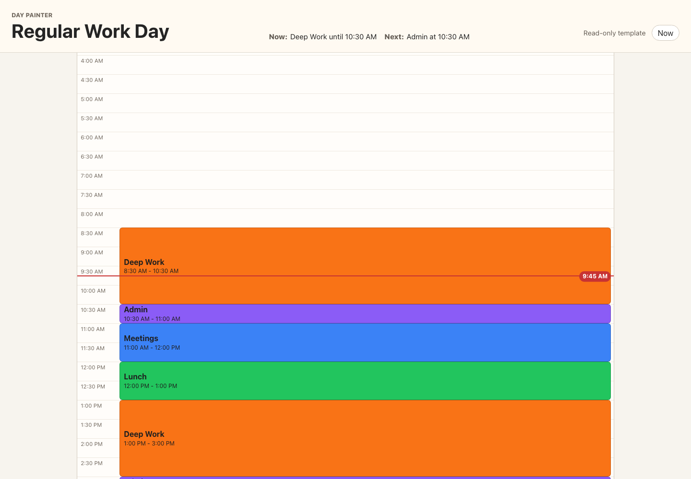

# Day Painter

Day Painter is a small, mobile-friendly day planner for painting focus blocks onto a day timeline.

It is built for simple reusable templates like a regular work day, a work day with gym, or a weekend rhythm. Create tasks, give them colours, paint them across the timeline, save the result as a named template, then open a read-only view to keep nearby while the day is happening.

## What It Does

- Create colour-coded tasks.
- Paint task allocations onto a timeline.
- Save and load named day templates.
- Open a full-screen read-only template view.
- Keep data locally in the browser with `localStorage`.

## Tech

React, TypeScript, Vite, SCSS modules, Vitest, and Playwright.
